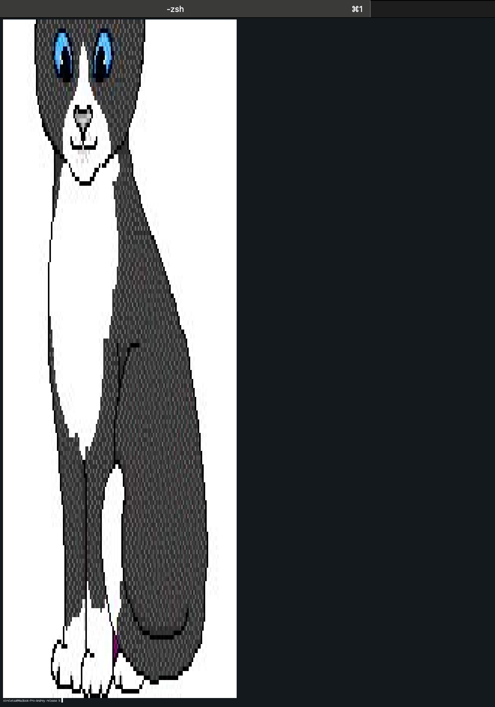

# Console Simple Image Viewer

## Using

```
Usage: csiv [OPTIONS] --image <image>

Options:
  -i, --image <image>  Image filepath
  -s, --scale <scale>  Image scale [default: 1]
  -h, --help           Print help
  -V, --version        Print version
```

## Example

```
./csiv -i "/opt/app/test.jpg"
```



```
./csiv -i "/opt/app/test.jpg" -s 0.5
```


